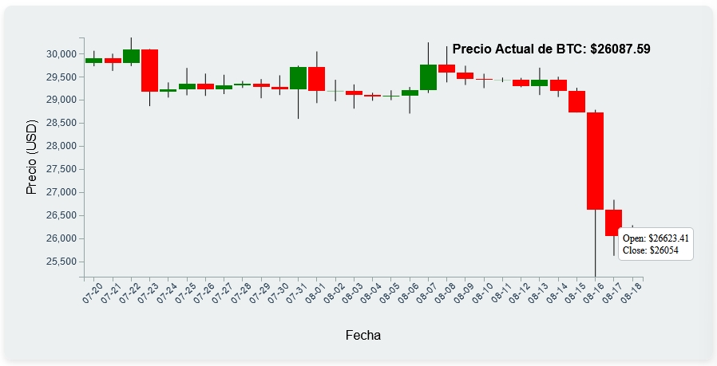
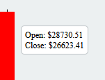

# Gráfica en Tiempo Real del Precio de Bitcoin (BTC)

El monitoreo en tiempo real del mercado de criptomonedas es esencial para los inversores y traders. Este proyecto proporciona una visión detallada y actualizada de los precios de Bitcoin (BTC), ofreciendo una herramienta robusta y visualmente atractiva.

## Resumen

Utilizando tecnologías modernas como D3.js, JavaScript, HTML y CSS, este proyecto presenta una gráfica de velas interactiva que muestra los datos históricos más recientes de BTC. La actualización en tiempo real y la presentación cuidadosa de los datos facilitan la interpretación de las tendencias y patrones del mercado.

### Características Principales

- **Gráfica de Velas**: Representación visual precisa de la apertura, el cierre, el máximo y el mínimo de cada período.
- **Actualización Automática**: Sincronización en tiempo real con los datos del mercado, con actualizaciones cada 10 segundos.
- **Interacción del Usuario**: Tooltips detallados y etiqueta del precio actual para una experiencia de usuario mejorada.
- **Diseño Profesional**: Diseño y estilo cuidadosos para una presentación clara y profesional.

## Tecnologías y Herramientas

- **D3.js**: Biblioteca potente y flexible para la visualización de datos.
- **JavaScript (ES6)**: Implementación de lógica de cliente moderna y eficiente.
- **HTML5 y CSS3**: Estructura y estilo responsivos y modernos.

## Instalación y Uso

1. **Clone el Repositorio**: `git clone https://github.com/your-username/real-time-btc-chart.git`
2. **Instale las Dependencias**: Ejecute `npm install` en la raíz del proyecto (si corresponde).
3. **Configure el Servidor Local**: Asegúrese de que los datos de BTC estén disponibles en `http://localhost:3000/btc-price`.
4. **Inicie el Proyecto**: Si hay un script de inicio, ejecute `npm start` o abra `index.html` en su navegador.
5. **Visualice la Gráfica**: Explore la gráfica en tiempo real en su navegador.

## Contribución y Soporte

Las contribuciones, los comentarios y las sugerencias son bienvenidos. Siéntase libre de abrir un problema o hacer un pull request. Para soporte directo, puede contactarme a través de [kuellarfer@gmail.com](mailto:kuellarfer@gmail.com).

## Licencia

Distribuido bajo la Licencia MIT. Vea `LICENSE` para más información.

## Autor

[Fernando Cuellar](https://github.com/ferkuellar) - Data Engineer, Especialista en Visualización de Datos

